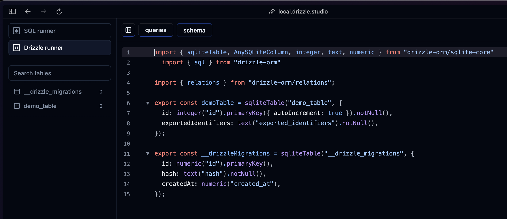
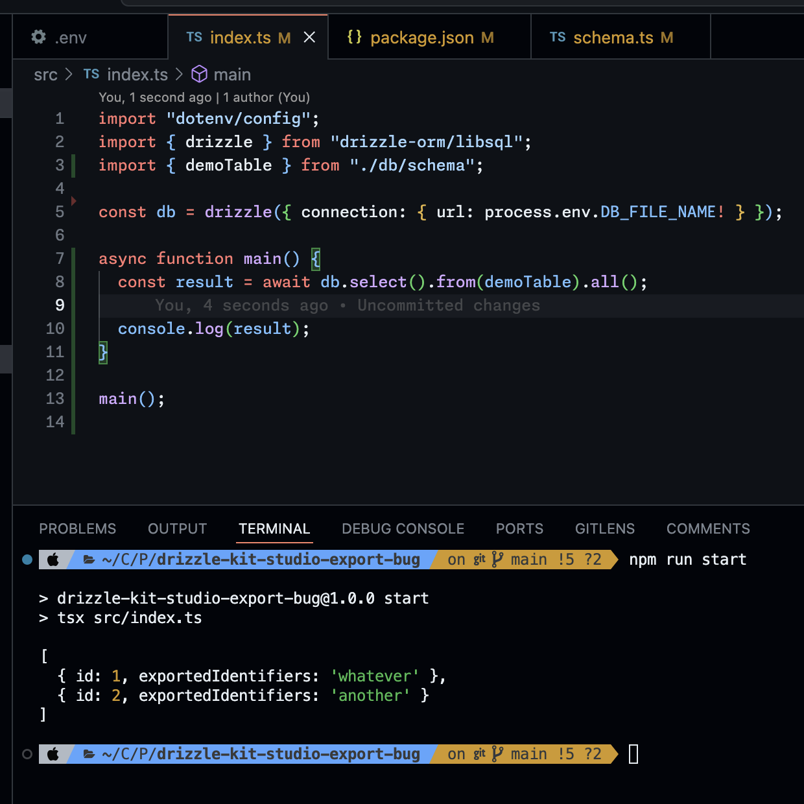
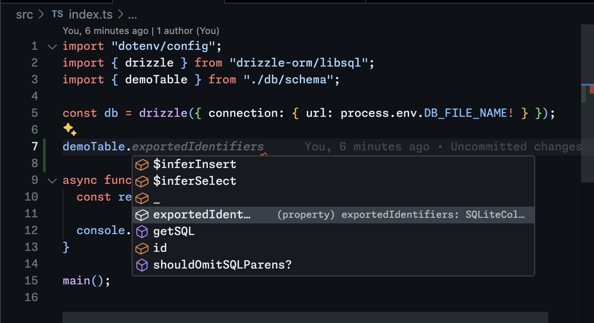
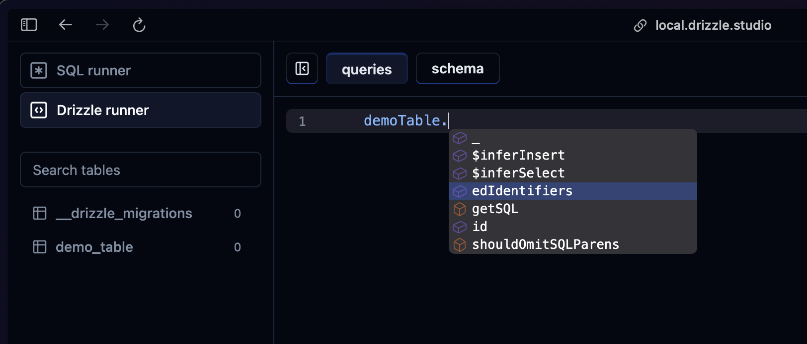
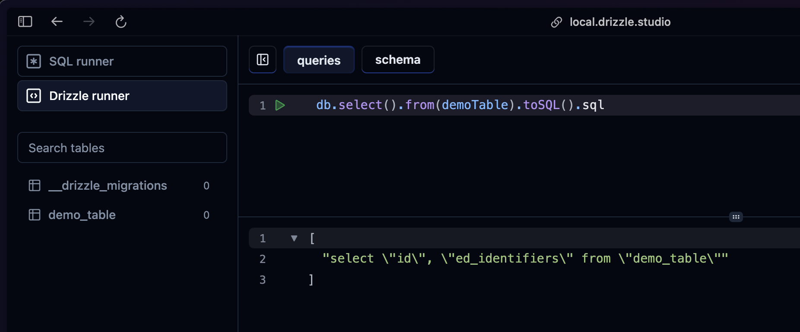

# Drizzle Kit 0.28.0 Schema Bug

This repo is a reproduction of an issue with table columns with the word "export" in them.

When Studio generates the drizzle client, it truncates the text "export" from the column name, causing an incorrect table definition and incorrect SQL to be generated.

## Set Up

### 1. Install dependencies

    $ npm install

### 2. Create `.env` file

    $ cp .env{.example,}

### 3. Create and migrate the SQLite database

    $ npm run migrate

### 4. Run the main example

This will insert a record and print the results of querying that record using Drizzle ORM.

    $ npm run start

### 5. Run Drizzle Kit Studio

Read on to see the issue explained in more detail.

    $ npm run studio

The generated schema looks correct:

---

The actual drizzle client has no problem executing a simple select query and returning all the results (the objects have the correct key `exportedIdentifiers`). In the second screenshot you can see that the schema object has the correct column name as well.

---

But Drizzle Kit Studio has a malformed object where the text "export" that prefixes the column has been truncated. In the second screenshot you can see that it generates SQL that isn't valid (according to the actual database schema, which does not have a column named `"ed_indentifiers"`).

